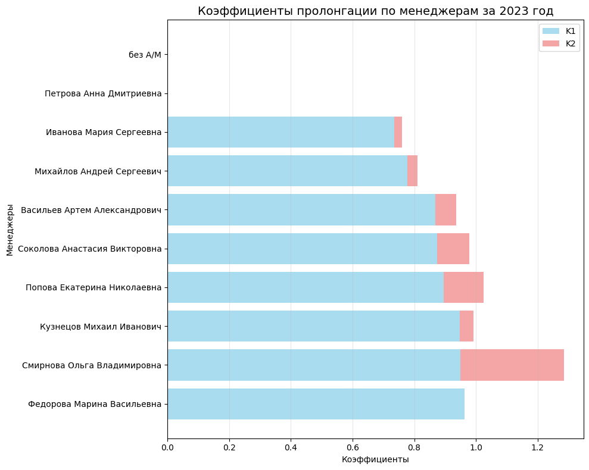

# Data Analys
В задание требовалось получить информацию о том, насколько хорошо сотрудники отдела справляются задачей пролонгации договоров клиентов. Требовалось получить результат за 2023 год.

## Результат рассчета

[]

## Метод решения
Были очищенны данные от дублей, пустые ячейки заполнены 0, а проекты с информацией стоп или end отсеяны.
Рассчет коэффициентов был произведет следующим образом:
1. Для проектов пролонгированных в первый месяц – отношении суммы отгрузки
проектов пролонгированных в первый месяц после завершения к сумме отгрузки
последнего месяца реализации всех завершившихся в прошлом месяце проектов.
2. Для проектов, пролонгированных во второй месяц – отношение суммы отгрузки
проектов, пролонгированных во второй месяц к сумме отгрузки последнего месяца
проектов, не пролонгированных в первый.

## Запуск программы
1.  Клонируйте репозиторий:
    ```bash
    git clone https://github.com/KarinaCreate/Data-Analys
    cd Data-Analys
    ```

2.  Установите зависимости:
    ```bash
    pip install -r requirements.txt
    ```

3.  Запустите решение:
    ```bash
    python Data_Analys.ipynb
    ```
